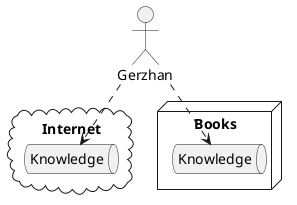

# Gerzhan Awesome

[github.com/gerzhan/Awesome](https://github.com/gerzhan/Awesome)

```plantuml
@startuml
skinparam backgroundcolor transparent

actor Gerzhan
cloud Internet {
queue Knowledge as InternetKnowledge
}

node Books {
queue Knowledge as BooksKnowledge
}

Gerzhan .-> InternetKnowledge

Gerzhan .-> BooksKnowledge

@enduml
```
